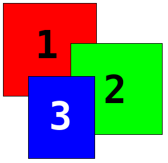

# tutorial-html5ui-stacking #
Code for an tutorial to do a simple stacking example using z-index.

Date: 2016-03-01 
Last Update: 2016-03-01

The order in the flow (the natural order), determines which element overlaps which other element. The first gets covered by second, gets covered by third.

- [What No One Told You About Z-Index](http://philipwalton.com/articles/what-no-one-told-you-about-z-index/) January 2013 - Very good article
- [The Z-Index CSS Property: A Comprehensive Look](https://www.smashingmagazine.com/2009/09/the-z-index-css-property-a-comprehensive-look/) September 2009 - Good, but dated

